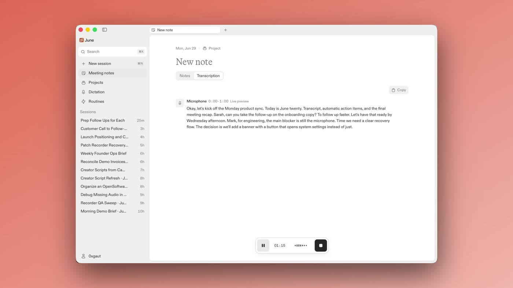
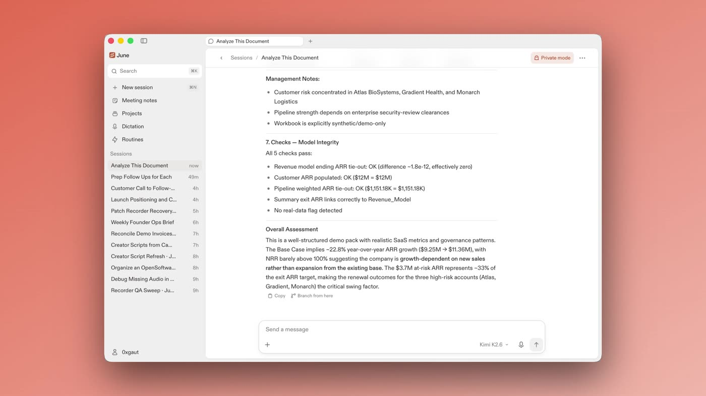
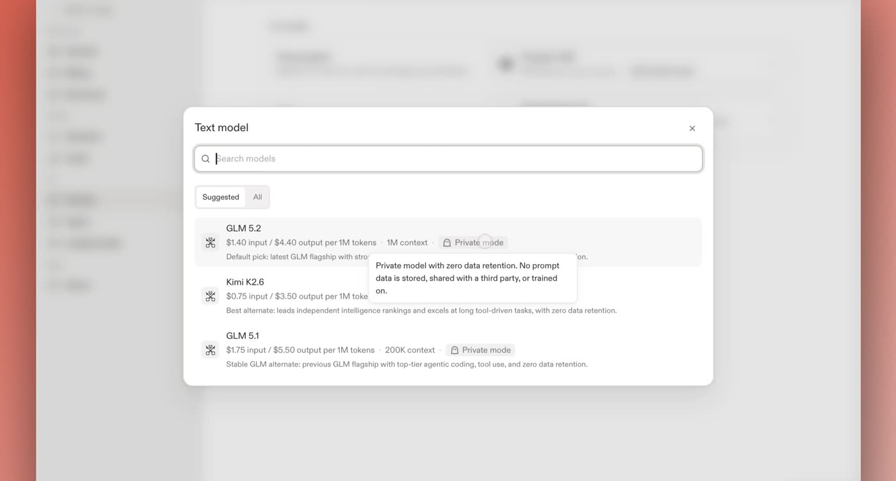

<p align="center">
  <picture>
    <source media="(prefers-color-scheme: dark)" srcset="public/clovy-wordmark.svg">
    
  </picture>
</p>

<h3 align="center">Private AI on your Mac</h3>

<p align="center">
  Clovy brings chat, voice dictation, meeting notes, and a local agent into a single
  private workspace. Local by default, routed through privacy-preserving AI, and
  open source so the privacy claims can be checked instead of believed.
</p>

<p align="center">
  <a href="https://opensoftware.co/download/mac">
    
  </a>
  <a href="https://github.com/open-software-network/os-june-releases/releases/latest">
    
  </a>
  <a href="https://trust.phala.com/app/6514acb0e08dc4825e2b6e22a46f0ed0ff455b54">
    
  </a>
  <a href="LICENSE">
    
  </a>
</p>

<p align="center">
  <a href="https://opensoftware.co/clovy">Website</a> ·
  <a href="https://opensoftware.co/clovy/changelog">Changelog</a> ·
  <a href="https://opensoftware.co/verify">Verify</a> ·
  <a href="https://t.me/+B4Z8KUqEsRc4ZGVh">Telegram</a> ·
  <a href="https://x.com/OpenSoftwareCo">X</a>
</p>

## Why Clovy

Most AI apps ask you to hand over your most sensitive data and trust them with
it. Every prompt, file, and meeting reveals something about you, and a cloud
agent with that reach is a remote company's window into your work.

Clovy is built the other way around. The app and the agent run on your Mac.
Notes, recordings, transcripts, files, sessions, and agent memory stay on your
machine by default. When Clovy needs model inference, the request goes through
Clovy API, an open source, TEE-attested service that keeps provider keys
server-side and routes to private models with zero data retention by default.
You do not have to take any of this on faith: the entire product is MIT
licensed, and the exact code serving production is cryptographically
verifiable.

## What Clovy does

- **Chat.** Ask questions, do research, brainstorm, and build plans without
  the conversation training someone else's model.
- **Dictation.** Hold a key, talk, release. Clovy turns your voice into clean,
  polished writing and pastes it into whatever app you were using, with
  push-to-talk and hands-free modes and selectable writing styles.
- **Meeting notes.** Clovy detects supported meetings and offers to take notes,
  without a bot joining the call. It records microphone or microphone plus
  system audio, orders the transcript into conversation turns, and generates
  editable notes. Saved audio is kept so failed steps can be retried without
  recording again.
- **Agent.** A Clovy-owned local agent built on the OpenAI Agents SDK that
  helps with files, research, and drafts. Sessions are sandboxed by default
  and risky actions wait for your approval. Extend it with skills.
- **Image generation.** Create images from a prompt, through the same private
  routing as everything else.
- **Your choice of models.** Pick generation, transcription, and dictation
  models from the live catalog, each labeled with its privacy tier. Bring your
  own Venice API key if you prefer.

<table>
  <tr>
    <td width="33%">
      
    </td>
    <td width="33%">
      
    </td>
    <td width="33%">
      
    </td>
  </tr>
  <tr>
    <td align="center">Meeting notes with live transcription, no bot in the call</td>
    <td align="center">The agent working through a spreadsheet in private mode</td>
    <td align="center">Every model labeled with its privacy tier</td>
  </tr>
</table>

## How Clovy keeps it private

1. **Local by default.** App state, recordings, transcripts, and agent memory
   live on your machine. The agent runs locally inside a macOS write-jail
   unless you opt a session out.
2. **Private models.** Model calls default to private Venice models with zero
   data retention: nothing stored, no training. Anonymized third-party models
   are opt-in, and those providers may retain what they receive under their
   own policies.
3. **Minimal retention.** Open Software's services store account, login, and
   billing records. Prompts, audio, transcripts, and files are not among them.
4. **Verifiable, not promised.** Clovy and Clovy API can be inspected independently
   of any model routing service or Chat. The desktop releases are signed and
   notarized, and their source is public. Clovy API runs in an Intel TDX
   confidential VM on Phala Cloud and publishes three useful anchors:
   - **Source:** this repository. The production image records its source
     commit in the OCI `org.opencontainers.image.revision` label.
   - **Image:** [`build-clovy-api.yml`](.github/workflows/build-clovy-api.yml)
     publishes [`ghcr.io/open-software-network/clovy-api`](https://github.com/open-software-network/os-clovy/pkgs/container/clovy-api);
     deploys pin immutable per-commit tags recorded as signed `deploy/<env>/<sha>` git tags.
   - **Attestation:** the [Phala Trust Center report](https://trust.phala.com/app/6514acb0e08dc4825e2b6e22a46f0ed0ff455b54)
     reports evidence for the image running inside the TEE.

   Every deployment serves a self-contained walkthrough at
   [`/verify`](https://opensoftware.co/verify). This evidence describes
   Clovy API only. The Open Software API and Chat publish their own source and
   runtime evidence, and Clovy does not need to pin their releases. Model privacy
   remains explicit provider evidence, which is why zero-retention private
   routing is the default.

## Download

Clovy runs on macOS 14 or later, Apple Silicon and Intel. Releases are signed,
notarized, and auto-updating, with `stable` and `rc` channels switchable
in-app. It is free to start.

- [Download for macOS](https://opensoftware.co/download/mac)
- [All releases and changelog source](https://github.com/open-software-network/os-june-releases)

If you use Homebrew, this is the recommended way to install:

```sh
brew install --cask open-software-network/tap/june
```

Windows builds cover the app shell, sign-in, microphone recording, notes, and
the bundled agent runtime, but not global dictation paste, system audio
capture, or the macOS sandbox. macOS is the primary target.

## Repository layout

This repo contains the full product: the desktop app and the service that
powers its metered AI calls.

```text
src/         React and TypeScript frontend
src-tauri/   Tauri v2 Rust desktop backend and native helpers
clovy-api/    Clovy API: models, transcription, generation, and billing
docs/        Architecture notes, ADRs, subsystem guides, and runbooks
spec/        Enforceable coding rules
specs/       Feature specs, plans, and validation notes
```

The desktop app never holds provider or OS Accounts App API keys; those live
only in Clovy API. Start with [docs/index.md](docs/index.md) for the full doc
map, [CONTEXT.md](CONTEXT.md) for the domain glossary, and
[AGENTS.md](AGENTS.md) for the contributor guide.

## Build from source

You need Node.js with pnpm 11 and a Rust toolchain. The exact pnpm version is
pinned in `package.json`.

```sh
git clone https://github.com/open-software-network/os-clovy
cd os-clovy
cp .env.example .env
cp clovy-api/.env.example clovy-api/.env
# Edit clovy-api/.env and set CLOVY__UPSTREAMS__VENICE__API_KEY.
pnpm install
pnpm tauri:dev
```

The example env files default to open source local mode: no OS Accounts login,
no billing, and a local Clovy API authenticated by a shared bearer token.
Provider keys belong only in `clovy-api/.env`, never in the root desktop
`.env`. A Venice API key is enough for transcription, generation, and
dictation cleanup.

See [docs/development.md](docs/development.md) for the day-to-day development
guide (ports, onboarding replay, local data, permissions, agent skills, and
test commands) and [docs/configuration.md](docs/configuration.md) for the full
configuration reference, including exposing your own models and running
against OS Accounts.

## Contributing

Clovy ships near-daily releases and development happens in the open.

Clovy is also the canonical technical name for repository-controlled packages,
crates, environment variables, workflows, and release artifacts. Released
June-era inputs and rollback outputs remain compatibility aliases, while the
installed bundle, executable, updater, and permission identities stay stable.
See [ADR-0055](docs/adr/0055-clovy-technical-identity-migrates-through-a-compatibility-bridge.md).

```sh
pnpm check         # lint and format (Biome)
pnpm typecheck
pnpm test          # frontend (Vitest)
pnpm test:rust     # desktop Rust
pnpm test:clovy-api # Clovy API
```

`make verify` mirrors CI. Start with [CONTRIBUTING.md](CONTRIBUTING.md), then
[AGENTS.md](AGENTS.md) for the full contributor guide; the enforceable UI
rules live in [spec/](spec/index.md). Report bugs through GitHub issues, and
report security vulnerabilities privately per [SECURITY.md](SECURITY.md).

- Community: [Clovy on Telegram](https://t.me/+B4Z8KUqEsRc4ZGVh)
- Updates: [@OpenSoftwareCo](https://x.com/OpenSoftwareCo) and the
  [changelog](https://opensoftware.co/clovy/changelog)

## License

Clovy is MIT licensed. See [LICENSE](LICENSE). Bundled third-party runtime
notices are tracked in [THIRD_PARTY_NOTICES.md](THIRD_PARTY_NOTICES.md).

## OS Platform

Agents and humans share product knowledge (memory, Issues, team timeline) through
the OS Platform. Connect the MCP endpoint `https://platform-api.opensoftware.co/mcp`
(OAuth via OS Accounts) in your agent client, or export an API key as
`OS_PLATFORM_API_KEY` for REST access (`https://app.opensoftware.co/api`, keys
under your platform profile → API keys). Conventions agents follow live in
[`AGENTS.md`](AGENTS.md) → "OS Platform (shared brain)".
